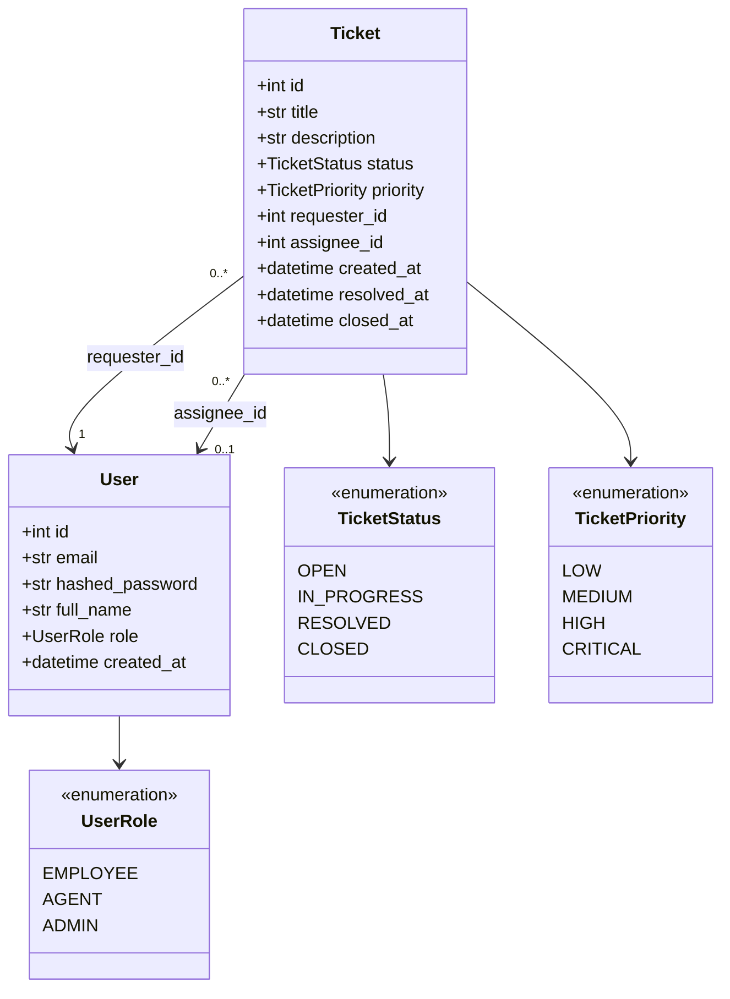
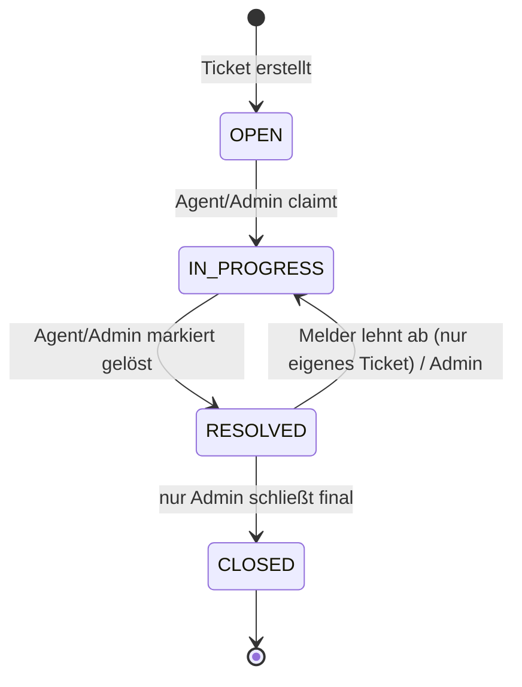
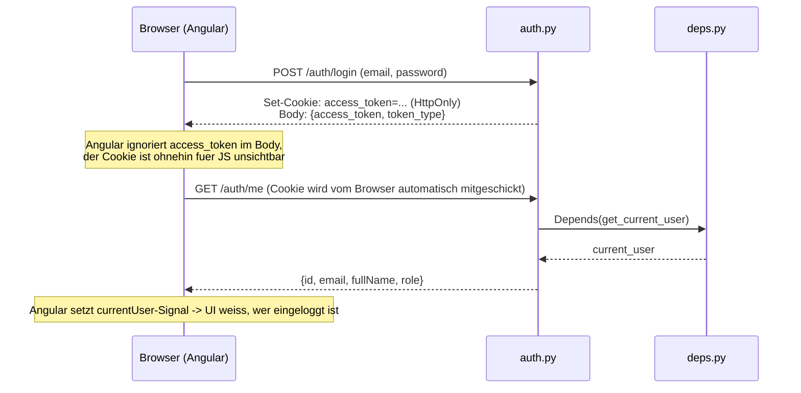

# SmartDesk – Architektur & Konzepte

Diese Datei erklärt **warum** SmartDesk so gebaut ist, wie es gebaut ist, und die wichtigsten technischen Konzepte dahinter – als Referenz für den aktuellen Architekturstand und die Begründung einzelner Entscheidungen.

Die normale [README.md](../README.md) beschreibt nur *wie man das Projekt startet*. Hier geht's um das *Warum* – Spezifikation, Architekturentscheidungen und die Softwaretechnik-Prinzipien dahinter.

**Inhalt:**
1. [Der große Überblick](#1-der-große-überblick)
2. [Spezifikation: was SmartDesk leisten soll](#2-spezifikation-was-smartdesk-leisten-soll)
3. [Tech-Stack: was und warum](#3-tech-stack-was-und-warum)
4. [Aufbau des Backends: die vier Schichten](#4-aufbau-des-backends-die-vier-schichten)
5. [Wichtige Datenmodell-Entscheidungen](#5-wichtige-datenmodell-entscheidungen)
6. [Sicherheitsentscheidungen bei den Auth-Endpunkten](#6-sicherheitsentscheidungen-bei-den-auth-endpunkten)
7. [Softwaretechnik-Prinzipien & Clean Code in SmartDesk](#7-softwaretechnik-prinzipien--clean-code-in-smartdesk)
8. [Frontend-Architekturentscheidungen](#8-frontend-architekturentscheidungen)
9. [Bewusste Einschränkungen & offene Punkte](#9-bewusste-einschränkungen--offene-punkte)
10. [Was noch fehlt (Kurz-Roadmap)](#10-was-noch-fehlt-kurz-roadmap)

---

## 1. Der große Überblick

SmartDesk besteht aus zwei komplett getrennten Programmen, die über HTTP miteinander reden:

- **Frontend** (`frontend/`) – eine Angular-Anwendung, läuft im Browser, zeigt die Oberfläche
- **Backend** (`backend/`) – eine FastAPI-Anwendung (Python), läuft als eigener Server, verwaltet Daten und Geschäftslogik

Diese Trennung nennt man **Client-Server-Architektur**. Der Vorteil: beide Teile lassen sich unabhängig voneinander entwickeln, testen und sogar auf unterschiedlichen Rechnern betreiben – das entspricht dem üblichen Aufbau moderner Firmen-Software.

Aktuell sind Frontend und Backend noch **nicht verbunden** – das Frontend zeigt noch Testdaten. Das Verbinden kommt in einer späteren Phase (siehe [Roadmap](#10-was-noch-fehlt-kurz-roadmap)).

---

## 2. Spezifikation: was SmartDesk leisten soll

Dieser Abschnitt ist bewusst getrennt von "Tech-Stack" gehalten – ein Kernprinzip aus der Requirements-Engineering-Lehre: **Spezifikation beschreibt WAS ein System tun soll, unabhängig davon, WIE (mit welcher Technologie) es das tut.** Architekturentscheidungen (Abschnitt 3–8) sind die Antwort auf diese Anforderungen, nicht umgekehrt.

### 2.1 Ausgangslage / Problem

In vielen Unternehmen läuft die interne IT-Unterstützung informell (Zuruf, E-Mail, Chat). Das hat drei typische Probleme, die SmartDesk adressiert:
- **Keine Nachvollziehbarkeit** – niemand kann später sagen, wer ein Problem wann gemeldet und wer es bearbeitet hat.
- **Kein Status** – der Melder weiß nicht, ob "dran gearbeitet wird" oder das Problem vergessen wurde.
- **Keine Priorisierung** – ein kritischer Systemausfall geht in derselben Mail-Inbox unter wie "Drucker klemmt".

SmartDesk löst das mit einem klassischen **ITSM-Ansatz** (IT Service Management – ein etablierter Fachbegriff, z.B. aus ITIL): Anfragen werden als **Tickets** mit festem Lebenszyklus erfasst, statt informell zu verpuffen.

### 2.2 Akteure (Rollen)

In der Requirements Engineering nennt man die Nutzergruppen von außen **Akteure (Actors)**. SmartDesk hat drei:

| Akteur | Bedeutung | Code-Entsprechung |
|---|---|---|
| **Employee** | meldet ein Problem (Melder eines Tickets) | `UserRole.EMPLOYEE` |
| **Agent** | bearbeitet gemeldete Tickets | `UserRole.AGENT` |
| **Admin** | verwaltet Nutzer, entscheidet über finale Statuswechsel | `UserRole.ADMIN` |

### 2.3 Funktionale Anforderungen

Funktionale Anforderungen beschreiben **konkretes Verhalten** des Systems ("das System muss X können"). Status zeigt, was schon umgesetzt ist:

| # | Anforderung | Status |
|---|---|---|
| FA-1 | Ein Employee kann sich registrieren (Name, E-Mail, Passwort) | ✅ `POST /auth/register` |
| FA-2 | Ein registrierter Nutzer kann sich einloggen und erhält einen Zugangs-Token | ✅ `POST /auth/login` |
| FA-3 | Ein Nutzer kann ein Ticket mit Titel, Beschreibung und Priorität erstellen | ✅ `POST /tickets` |
| FA-4 | Tickets können gelesen, teilweise aktualisiert und gelöscht werden | ✅ `GET/PATCH/DELETE /tickets/{id}` |
| FA-5 | Ein Ticket durchläuft einen festen Status-Lebenszyklus (offen → in Bearbeitung → gelöst → geschlossen) | ✅ `PATCH /tickets/{id}/status`, Regeln in `app/services/ticket_lifecycle.py` |
| FA-6 | Nur eingeloggte Nutzer dürfen auf Ticket-Endpunkte zugreifen | ✅ `get_current_user`-Dependency (`app/core/deps.py`), an jedem Ticket-Endpunkt |
| FA-7 | Ein Agent kann sich ein Ticket zuweisen bzw. zugewiesen bekommen | 🔶 Datenfeld (`assignee_id`) über generisches `PATCH /tickets/{id}` setzbar, kein eigener "claim"-Endpunkt |
| FA-8 | Nur ein Admin darf ein Ticket final schließen | ✅ in `ALLOWED_TRANSITIONS` (`RESOLVED → CLOSED` nur für `ADMIN`) |
| FA-9 | Das Dashboard zeigt Kennzahlen (offene Tickets, kritische Incidents, heute gelöst) | 🔶 UI steht, nutzt noch Mock-Daten statt echter API |

Diese Tabelle ist zugleich ein kleines Beispiel für Requirements-Tracing: jede Zeile lässt sich auf einen Commit oder eine Datei zurückführen – das ist genau das Prinzip, das professionelle RE-Werkzeuge (z.B. Jira, Azure DevOps mit verlinkten Work Items) automatisieren.

### 2.4 Nicht-funktionale Anforderungen

Nicht-funktionale Anforderungen (NFA) beschreiben **Qualitätseigenschaften** statt konkretem Verhalten – oft nach der ISO-25010-Norm kategorisiert:

| Kategorie | Anforderung | Wie SmartDesk das umsetzt |
|---|---|---|
| **Sicherheit** | Passwörter dürfen niemals im Klartext gespeichert werden | bcrypt-Hashing ([Abschnitt 6](#6-sicherheitsentscheidungen-bei-den-auth-endpunkten)) |
| **Sicherheit** | Zugriff muss nachweisbar an einen Nutzer gebunden sein | JWT mit `sub`/`role`/`exp` |
| **Wartbarkeit** | Code muss von anderen Entwicklern verstanden und erweitert werden können | Schichtenarchitektur ([Abschnitt 4](#4-aufbau-des-backends-die-vier-schichten)), durchgängige Kommentare |
| **Nachvollziehbarkeit** | Datenbank-Änderungen müssen versioniert und rückgängig machbar sein | Alembic-Migrationen |
| **Testbarkeit** | Kernlogik muss automatisiert geprüft werden können, ohne die ganze App zu starten | reine Funktionen in `security.py`/`ticket_lifecycle.py` + pytest + CI |
| **Portabilität** | Die Entwicklungsumgebung muss auf jedem Rechner identisch reproduzierbar sein | Docker Compose |
| **Konsistenz** | Ungültige Datenzustände (z.B. Ticket ohne existierenden Melder) dürfen nicht in der DB landen | Foreign Keys, DB-Enums, serverseitige Prüfungen |

### 2.5 Zwei Anwendungsfälle (Use Cases) im klassischen Format

Ein Use Case beschreibt einen einzelnen, abgeschlossenen Ablauf aus Sicht eines Akteurs – ein in der Requirements-Engineering-Lehre verbreitetes Format (Akteur / Vorbedingung / Ablauf / Nachbedingung / Fehlerfälle):

**UC-1: Ticket erstellen**
- **Akteur:** Employee
- **Vorbedingung:** Nutzer ist registriert
- **Ablauf:** Nutzer sendet `POST /tickets` mit Titel, optionaler Beschreibung und Priorität
- **Nachbedingung:** Neues Ticket existiert mit Status `open`, `requester_id` aus dem eingeloggten Nutzer, ist über `GET /tickets/{id}` abrufbar
- **Fehlerfall:** kein gültiger Zugangs-Token mitgeschickt → `401 Unauthorized`

**UC-2: Login**
- **Akteur:** registrierter Nutzer (jede Rolle)
- **Vorbedingung:** Account existiert (`POST /auth/register` wurde vorher erfolgreich aufgerufen)
- **Ablauf:** Nutzer sendet E-Mail + Passwort an `POST /auth/login`
- **Nachbedingung:** Nutzer erhält einen signierten JWT, gültig 60 Minuten
- **Fehlerfall:** E-Mail unbekannt ODER Passwort falsch → in **beiden** Fällen identischer `401 Unauthorized` (bewusste Anti-User-Enumeration-Entscheidung, siehe Abschnitt 6)

### 2.6 Einordnung: Spezifikation vs. Architekturbeschreibung

Kurze Begriffsklärung, da beide Begriffe in der Praxis nicht immer sauber getrennt werden:
- **Spezifikation / Lastenheft** = *was* soll das System können (Abschnitt 2 hier)
- **Architekturbeschreibung** = *wie* wird das technisch umgesetzt, mit welchen Bausteinen, in welchen Schichten, mit welchen Entscheidungen und Begründungen (Abschnitt 3–8 hier)

Diese Datei mischt beides bewusst in einem Dokument, weil das Projekt dafür klein genug ist – bei größeren Projekten trennt man das oft in eigene Dokumente (z.B. ein Lastenheft/Pflichtenheft getrennt von einer arc42-Architekturdokumentation). arc42 ist ein verbreitetes Standard-Gliederungsschema für Architekturdokumente – vieles hier (Bausteinsicht = Abschnitt 4, Entscheidungen/Rationale = die "Warum"-Boxen überall) folgt lose diesem Gedanken, ohne die volle arc42-Struktur zu übernehmen.

---

## 3. Tech-Stack: was und warum

| Baustein | Wahl | Warum |
|---|---|---|
| Frontend-Framework | Angular | war Ausgangspunkt des Projekts, moderne Signals-API |
| Backend-Framework | FastAPI (Python) | s.u. |
| Datenbank | PostgreSQL | s.u. |
| ORM | SQLAlchemy | s.u. |
| Migrationen | Alembic | s.u. |
| Auth | JWT + bcrypt | s.u. |
| Dev-Umgebung | Docker Compose | s.u. |

### Warum FastAPI?

FastAPI ist ein Python-Framework zum Bauen von REST-APIs. Vorteile, die für dieses Projekt den Ausschlag gaben:
- **Automatische Validierung** – Datenstrukturen werden einmal beschrieben (die Pydantic-Schemas in `app/schemas/`), FastAPI prüft jede eingehende Anfrage automatisch dagegen.
- **Automatische Dokumentation** – die Swagger-UI unter `/docs` entsteht komplett automatisch aus dem Code, ohne separate Pflege.
- **Type Hints als echtes Werkzeug, nicht nur Deko** – FastAPI liest Python-Typannotationen (`def foo(x: int)`) und nutzt sie aktiv für Validierung und Dokumentation.
- Weit verbreitet in professionellen Python-Backends, dadurch gute Vergleichbarkeit mit Industriestandards.

### Warum PostgreSQL?

PostgreSQL ist eine **relationale** Datenbank – Daten liegen in Tabellen mit fest definierten Spalten, Tabellen können über **Fremdschlüssel** (Foreign Keys) miteinander verbunden werden (ein Ticket "gehört" über `requester_id` zu einem User). Der Vorteil gegenüber einer dokumentbasierten DB (wie MongoDB oder Firebase Firestore): die Datenbank selbst erzwingt Konsistenz – ein Ticket kann z.B. gar nicht erst mit einer `requester_id` gespeichert werden, die auf keinen existierenden User zeigt. Diese Regel wurde in Phase 2 eingeführt und über die Migrationen nachvollziehbar dokumentiert.

### Warum ein ORM (SQLAlchemy)?

Ein **ORM** (Object-Relational Mapper) übersetzt zwischen "Python-Objekten" und "Datenbank-Tabellenzeilen". Statt rohes SQL zu schreiben (`SELECT * FROM tickets WHERE ...`), wird Python-Code geschrieben (`db.execute(select(Ticket))`), das SQLAlchemy im Hintergrund in SQL übersetzt. Vorteil: weniger tippfehler-anfälliger String-SQL-Code, Autovervollständigung, und eine durchgängige Sprache (Python) statt eines ständigen Wechsels zwischen Python und SQL.

### Warum Migrationen (Alembic)?

Ein Datenbank-Schema (welche Tabellen, welche Spalten gibt es) verändert sich über die Zeit – z.B. von "nur Tickets" zu "Tickets + Users mit Fremdschlüsseln". Eine **Migration** ist eine versionierte, nachvollziehbare Beschreibung so einer Änderung (ähnlich wie ein Git-Commit, nur für die Datenbankstruktur statt für Code). Alembic verwaltet diese Migrationen als Python-Dateien in `backend/alembic/versions/`. Der große Vorteil: eine Migration lässt sich **rückgängig machen** (`downgrade`) und es lässt sich **nachvollziehen**, wer wann was am Schema geändert hat.

### Warum Docker/Docker Compose?

Docker sorgt dafür, dass Backend und Datenbank **isoliert und reproduzierbar** laufen, ohne manuelle Python-/PostgreSQL-Installation auf dem Entwicklungsrechner. `docker compose up` startet beides mit einem Befehl. Ein **Image** ist dabei der unveränderliche Bauplan (Code + Abhängigkeiten + Mini-Betriebssystem-Basis), ein **Container** eine laufende Instanz davon.

### Warum JWT + bcrypt für Auth?

- **bcrypt** hasht Passwörter absichtlich langsam, damit gestohlene Passwort-Hashes nicht in Sekunden durch Ausprobieren geknackt werden können.
- **JWT** merkt sich, wer eingeloggt ist, ohne dass der Server selbst etwas speichern muss – skaliert besser und ist der heute übliche Standard für APIs. Details dazu in [Abschnitt 6](#6-sicherheitsentscheidungen-bei-den-auth-endpunkten).

---

## 4. Aufbau des Backends: die vier Schichten

Jede Ressource (z.B. Ticket) ist auf vier Dateien/Schichten aufgeteilt, die jede eine klare Aufgabe hat:

```
Router (app/routers/)      → nimmt HTTP-Anfragen entgegen, ruft die anderen Schichten auf
Schema (app/schemas/)      → beschreibt, wie Ein-/Ausgabe-JSON aussehen darf (Validierung)
Model (app/models/)        → beschreibt die Datenbank-Tabelle (SQLAlchemy)
Service (app/services/)    → Geschäftslogik, die mehr ist als simples Lesen/Schreiben
                              (z.B. app/services/ticket_lifecycle.py: prüft Status-Übergänge
                              gegen Rollenregeln, bevor der Router überhaupt committet)
```

Grund für diese Trennung: jede Schicht hat genau eine Verantwortung – der Router weiß nichts über SQL, das Model weiß nichts über HTTP. Das macht jede Schicht einzeln verständlich und testbar, auch wenn das Projekt wächst.

Der Fachbegriff dafür ist **Schichtenarchitektur (Layered Architecture)** – eines der ältesten und am weitesten verbreiteten Architekturmuster überhaupt (auch als "3-Tier-Architektur" bekannt). Dieser Abschnitt entspricht im arc42-Sinn im Grunde der "Bausteinsicht" der Architektur.

Das folgende Sequenzdiagramm zeigt das Zusammenspiel der Schichten und Schnittstellen am Beispiel von `POST /tickets`: der Router ruft zunächst die Authentifizierungs-Dependency auf (Abschnitt 6), erst danach die eigentliche Erstell-Logik.

```mermaid
sequenceDiagram
    participant C as Client
    participant R as Router (tickets.py)
    participant D as get_current_user (deps.py)
    participant Sec as security.py
    participant DB as Datenbank

    C->>R: POST /tickets<br/>Authorization: Bearer &lt;token&gt;
    R->>D: Depends(get_current_user)
    D->>Sec: decode_access_token(token)
    Sec-->>D: Payload {sub, role, exp}
    D->>DB: db.get(User, sub)
    DB-->>D: User
    D-->>R: current_user
    R->>DB: Ticket(..., requester_id=current_user.id)<br/>db.commit()
    DB-->>R: gespeichertes Ticket
    R-->>C: 201 Created + Ticket (JSON)
```

---

## 5. Wichtige Datenmodell-Entscheidungen

Das folgende Klassendiagramm zeigt die beiden zentralen Entitäten und ihre Beziehung zueinander. `requester_id` und `assignee_id` sind beides Fremdschlüssel auf `User`, aber mit unterschiedlicher Multiplizität – jedes Ticket hat genau einen Melder, aber optional (0..1) einen Bearbeiter:



**Warum drei Rollen (`employee`/`agent`/`admin`) statt z.B. nur "Nutzer"?** Weil ein echtes ITSM-Tool (wie Jira Service Management) genau diese Trennung braucht: Melder ≠ Bearbeiter ≠ Administrator. Das macht die spätere Berechtigungslogik (wer darf ein Ticket schließen?) überhaupt erst sinnvoll.

**Warum 4 Ticket-Status statt 3 (`open`/`in_progress`/`resolved`/`closed`)?** Mit nur 3 Status ist "schließen" eine einzelne Aktion ohne Kontrolle. Mit `resolved` als Zwischenschritt gibt es eine echte Freigabe-Regel: ein Agent markiert als gelöst, aber nur ein Admin (oder der Melder durch Ablehnen) entscheidet über den nächsten Schritt.

**Warum die Status-Übergänge als einfaches Python-Dictionary statt einer State-Machine-Bibliothek?** Bei nur 4 Zuständen ist eine Bibliothek unnötige Komplexität – `ALLOWED_TRANSITIONS` in [ticket_lifecycle.py](../backend/app/services/ticket_lifecycle.py) ist ein `dict[Status, dict[Status, set[Rolle]]]`, genauso mächtig wie eine State-Machine-Bibliothek, aber ohne zusätzliche Abhängigkeit komplett durchschaubar. Das ist ein bewusstes **YAGNI**-Prinzip ("You Aren't Gonna Need It") – nicht jede Modellierungsfrage braucht die "enterprise" Lösung.

**Wer darf welchen Status-Übergang auslösen?** Umgesetzt in [apply_status_transition](../backend/app/services/ticket_lifecycle.py): `OPEN → IN_PROGRESS` und `IN_PROGRESS → RESOLVED` dürfen `AGENT`/`ADMIN` (ein Ticket claimen bzw. als gelöst markieren), `RESOLVED → CLOSED` nur `ADMIN` (FA-8), `RESOLVED → IN_PROGRESS` darf `EMPLOYEE` **nur beim eigenen** Ticket auslösen (Ablehnen der Lösung) oder `ADMIN` bei jedem. `CLOSED` ist ein Endzustand ohne Übergänge raus. Das ist eine **fachliche Entscheidung, keine rein technische** – bei abweichenden Anforderungen (z.B. sollen Agents nur eigene zugewiesene Tickets bearbeiten dürfen) ist genau diese Tabelle die Stelle zum Anpassen.

Als Zustandsdiagramm (UML State Machine) entspricht `ALLOWED_TRANSITIONS` genau folgendem Bild:



**Warum `requester_id` und `assignee_id` als zwei getrennte Felder?** Weil "wer hat's gemeldet" und "wer bearbeitet's gerade" unterschiedliche Dinge sind, die sich unabhängig voneinander ändern (ein Ticket kann den Bearbeiter wechseln, der Melder bleibt immer gleich).

---

## 6. Sicherheitsentscheidungen bei den Auth-Endpunkten

`POST /auth/register` und `POST /auth/login` (in `backend/app/routers/auth.py`) enthalten mehrere Design-Entscheidungen, die nicht offensichtlich sind, wenn man nur den Code liest:

**Warum bekommt `RegisterRequest` kein `role`-Feld?** Würde der Client die Rolle selbst mitschicken dürfen, könnte sich jeder bei der Registrierung einfach `role: "admin"` setzen. Die Rolle wird deshalb serverseitig fest auf `EMPLOYEE` gesetzt – der Client hat darauf keinen Einfluss. (Wie ein Nutzer später zu `agent`/`admin` wird, ist bewusst noch offen – das wäre ein eigener, geschützter Endpunkt, den nur ein Admin aufrufen darf.)

**Warum `409 Conflict` bei doppelter Email, aber `401 Unauthorized` bei falschem Login?** HTTP-Statuscodes haben feste Bedeutungen: 409 heißt "die Anfrage selbst ist okay, aber sie widerspricht dem aktuellen Zustand der Ressource" (die Email existiert schon). 401 heißt "nicht authentifiziert" – passt für falsche Zugangsdaten. Beide Fälle bewusst unterschiedliche Codes, weil sie fachlich unterschiedliche Dinge bedeuten (Verwendung falscher Statuscodes ist ein klassischer API-Design-Fehler).

**Warum liefern "falsches Passwort" und "Email existiert nicht beim Login" exakt dieselbe Fehlermeldung?** Das ist eine bewusste Sicherheitsentscheidung gegen **User Enumeration**: Würde der Server bei einer unbekannten Email eine andere Meldung zeigen als bei einem falschen Passwort, könnte ein Angreifer systematisch durchprobieren, welche Email-Adressen überhaupt registriert sind – ein Datenschutzproblem für sich, selbst ohne dass ein Passwort geknackt wird.

**Warum `OAuth2PasswordRequestForm` (Formular-Daten) statt JSON beim Login?** Das ist FastAPIs eingebauter, standardisierter Weg für Login-Endpunkte – dadurch funktioniert der "Authorize"-Button in der automatisch generierten Swagger-UI (`/docs`) ohne Zusatzaufwand.

**Was bewusst noch NICHT geprüft wird:** `RegisterRequest.email` ist aktuell ein einfacher `str` (kein Format-Check wie "enthält @"), und `RegisterRequest.password` hat keine Mindestlänge. Das ist keine Nachlässigkeit, sondern ein dokumentierter offener Punkt – siehe [Abschnitt 9](#9-bewusste-einschränkungen--offene-punkte) für die konkrete Lösung, die dafür ansteht.

### Wie der Token im Browser gespeichert wird: HttpOnly-Cookie statt localStorage

Eine SPA muss den JWT irgendwo zwischen Login und jeder folgenden Anfrage aufbewahren. Zwei verbreitete Optionen und die Abwägung dahinter:

| Option | Vorteil | Risiko |
|---|---|---|
| `localStorage` | einfach, reiner Frontend-Code | per JavaScript auslesbar – bei einer XSS-Lücke irgendwo in der App kann eingeschleuster Code den Token direkt stehlen |
| `HttpOnly`-Cookie | für JavaScript unsichtbar (`document.cookie` zeigt ihn nicht), Browser hängt ihn automatisch an jede Anfrage | verlagert das Risiko auf **CSRF** (eine fremde Seite könnte eine Anfrage auslösen, die der Browser mit dem Cookie versieht) |

SmartDesk verwendet den **HttpOnly-Cookie**. Eine naheliegende Alternative – den Token einfach *verschlüsselt* in `localStorage` ablegen – löst das Problem nicht wirklich: der Schlüssel zum Entschlüsseln müsste ebenfalls im Frontend-Code liegen, und genau dort läuft bei einer XSS-Lücke auch der eingeschleuste Angreifer-Code – er hätte also denselben Zugriff auf die Entschlüsselung wie die App selbst. Nur ein für JavaScript grundsätzlich unerreichbarer Speicherort (der Cookie mit `HttpOnly`-Flag) schließt diesen Angriffsweg tatsächlich.

Die verbleibende CSRF-Lücke wird über das Cookie-Attribut `SameSite=Lax` eingedämmt ([login](../backend/app/routers/auth.py)): der Browser schickt den Cookie dann nicht bei Anfragen mit, die von einer anderen Seite ausgelöst werden.

**Konsequenz für die API:** `POST /auth/login` liefert den Token weiterhin zusätzlich im JSON-Body zurück (`TokenResponse`) – nicht fürs Frontend, sondern damit Swagger UI (`/docs`) und manuelle Tests per curl weiterhin über den klassischen `Authorization`-Header funktionieren. Das Angular-Frontend liest dieses Feld bewusst nie. `get_current_user` akzeptiert deshalb beide Quellen (Header ODER Cookie, siehe [deps.py](../backend/app/core/deps.py)), und da das Frontend den Token selbst nie sieht, gibt es `GET /auth/me`: einen Endpunkt, der anhand des Cookies zurückmeldet, wer aktuell eingeloggt ist – genutzt beim Start der Angular-App, um nach einem Seiten-Reload den Session-Status wiederherzustellen (siehe [Auth-Service](../frontend/src/app/core/auth/auth.ts)).



### Wie die Ticket-Endpunkte abgesichert sind

`app/core/deps.py` enthält `get_current_user`, eine Dependency, die vor jedem Ticket-Endpunkt läuft (`Depends(get_current_user)` in `tickets.py`):

1. Der Token kommt aus dem `Authorization`-Header ODER dem `access_token`-Cookie (s.o.) – erste gefundene Quelle gewinnt.
2. `decode_access_token` (aus `security.py`) prüft Signatur und Ablaufzeit – schlägt das fehl (`jwt.PyJWTError`), gibt es sofort `401`.
3. Die `sub`-Claim aus dem Token wird als User-ID benutzt, um den `User` zu laden – existiert er nicht mehr (z.B. gelöscht), ebenfalls `401`.

**Wichtige Unterscheidung:** Das ist **Authentifizierung** (ist der Nutzer überhaupt eingeloggt?), zusätzlich dazu **Autorisierung** (darf diese konkrete Rolle diese konkrete Aktion?) – umgesetzt über zwei verschiedene Mechanismen, je nach Frage:
- **Ja/Nein-Berechtigung** (darf diese Rolle das überhaupt?) → `Depends(require_roles(...))` in `deps.py`, z.B. `DELETE /tickets/{id}` nur für `ADMIN`, `PATCH /tickets/{id}` nur für `AGENT`/`ADMIN`.
- **Sichtbarkeits-/Objekt-Filterung** (welche Teilmenge darf diese Rolle sehen?) → Filterlogik direkt im Endpunkt, z.B. `GET /tickets` liefert `EMPLOYEE` nur die eigenen Tickets, `GET /tickets/{id}` gibt bei fremdem Ticket bewusst `404` statt `403` zurück (verhindert, dass sich die Existenz eines fremden Tickets überhaupt erkennen lässt – siehe **Object-Level Authorization** / IDOR-Vermeidung).

Für Status-Übergänge läuft die Rollenprüfung weiterhin separat in `ticket_lifecycle.py` (siehe Abschnitt 5), weil sie vom *aktuellen Status* abhängt, nicht nur von der Rolle allein.

Eine zweite Konsequenz derselben Änderung: `POST /tickets` nimmt `requester_id` nicht mehr vom Client entgegen (das wäre seit es einen eingeloggten Nutzer gibt ein Sicherheitsloch – jeder hätte Tickets im Namen anderer anlegen können), sondern setzt es serverseitig aus `current_user.id`.

---

## 7. Softwaretechnik-Prinzipien & Clean Code in SmartDesk

Dieser Abschnitt macht explizit, welche im Berufsleben verbreiteten Prinzipien in SmartDesk stecken, jeweils mit Bezug auf die konkrete Fundstelle im Code.

**Single Responsibility Principle (SRP)** – Teil der SOLID-Prinzipien: jede Einheit (Datei, Klasse, Funktion) sollte genau einen Grund haben, sich zu ändern. Sichtbar an der [Schichtenarchitektur](#4-aufbau-des-backends-die-vier-schichten): ändert sich die Validierungsregel für ein Ticket, ändert sich nur `schemas/ticket.py` – nicht der Router, nicht das Model. Genauso bei `security.py`: die Datei weiß nur etwas über Hashing/JWT, nichts über HTTP oder die Datenbank.

**DRY (Don't Repeat Yourself)** – Wissen soll an genau einer Stelle im Code stehen. Beispiele in SmartDesk:
- `get_settings()` mit `@lru_cache` (`config.py`) – Umgebungsvariablen werden genau einmal eingelesen, nicht bei jedem Zugriff neu.
- `STATUS_LABELS` (`ticket-card.ts`) – die deutschen Beschriftungen für Ticket-Status stehen an einer Stelle, nicht verstreut in jedem Template.
- `viewTabs` (`dashboard.ts`) – eine einzige Datenquelle für Tab-Beschriftung, Filterlogik und Abschnittsüberschrift gleichzeitig, statt das dreimal separat zu pflegen.

**Dependency Injection** – ein Muster, bei dem eine Funktion ihre Abhängigkeiten (z.B. eine Datenbank-Session) von außen gereicht bekommt, statt sie selbst zu beschaffen. Umgesetzt über `db: Session = Depends(get_db)` in jedem Router. Macht Code testbar: `list_tickets(db: Session = Depends(get_db))` lässt sich in einem Test mit einer Test-Session aufrufen, ohne die echte Datenbank-Verbindungslogik nachzubauen.

**Fail Fast / frühzeitige Validierung** – Beispiel `create_ticket` in `tickets.py`: statt eine ungültige `requester_id` bis zum `db.commit()` durchlaufen zu lassen (wo sie als kryptischer Postgres-Fehler auffliegen würde), wird sie sofort geprüft und mit einer verständlichen `404`-Antwort abgebrochen. Fehler so früh wie möglich, so verständlich wie möglich melden.

**Testbarkeit als Designkriterium, nicht Nachgedanke** – dass `hash_password`/`verify_password`/`create_access_token` (in `security.py`) und `apply_status_transition` (in `ticket_lifecycle.py`) reine Funktionen ohne Datenbank- oder HTTP-Abhängigkeit sind, ist kein Zufall: genau das macht sie in den jeweiligen Tests ohne Testdatenbank, ohne laufenden Server, in Millisekunden testbar.

**Aussagekräftige Namen statt Kommentar-Krücken** – z.B. `openTicketCount`, `verify_password`, `apply_status_transition` statt generischer Namen wie `data` oder `helper`. Guter Name = weniger Erklärungsbedarf.

**Konsistente Commit-Historie (Conventional Commits)** – die Commit-Historie (`git log`) folgt durchgängig `feat: ...`, `fix: ...`, `docs: ...`, `test: ...`, `ci: ...`, `refactor: ...`. Das ist die verbreitete **Conventional-Commits**-Konvention – jeder Commit sagt in einem Wort, *welche Art* von Änderung er enthält. In Teams ermöglicht das automatisch generierte Changelogs und macht die Historie beim Debuggen deutlich lesbarer.

**YAGNI ("You Aren't Gonna Need It")** – bewusster Verzicht auf Komplexität, die (noch) nicht gebraucht wird. Siehe die State-Machine-Entscheidung in [Abschnitt 5](#5-wichtige-datenmodell-entscheidungen): kein Framework für 4 Zustände.

---

## 8. Frontend-Architekturentscheidungen

**Smart/Container- vs. Dumb/Presentational-Komponenten** – ein sehr verbreitetes Frontend-Muster (nicht Angular-spezifisch, genauso in React/Vue üblich): eine "Smart"-Komponente hält Zustand und Logik, eine "Dumb"-Komponente bekommt fertige Daten nur gereicht und zeigt sie an, ohne selbst zu wissen, woher sie kommen. SmartDesk setzt das bereits um:
- `Dashboard` (`dashboard.ts`) ist die **Smart Component**: hält `tickets` als Signal, berechnet `openTicketCount`, `visibleTickets` etc.
- `TicketCard` (`ticket-card.ts`) ist **Presentational**: bekommt ein einzelnes `Ticket` über `input.required<Ticket>()` rein, berechnet daraus nur eine Anzeige-Beschriftung (`statusLabel`) – sie weiß nichts über die Gesamtliste, Filter oder Tabs.

Der Vorteil: `TicketCard` lässt sich isoliert wiederverwenden und testen, ohne die gesamte Dashboard-Logik mitzuschleppen.

**Signals statt manueller Zustandsverwaltung** – Angular bietet mit RxJS auch einen mächtigeren, aber komplexeren Ansatz für asynchrone Datenströme. Für simplen, synchronen UI-Zustand (welcher Tab ist aktiv, welche Tickets gibt es gerade) sind Signals die schlankere, seit neueren Angular-Versionen empfohlene Lösung – wieder ein Fall von "die einfachste Lösung wählen, die das Problem tatsächlich löst", nicht das mächtigste verfügbare Werkzeug.

**Neue `@for`/`@empty`-Control-Flow-Syntax** statt des älteren `*ngFor` – seit Angular 17 die empfohlene, kompiler-geprüfte Syntax für Schleifen/bedingte Anzeige in Templates (sichtbar in `dashboard.html`), u.a. mit eingebautem `@empty`-Block für den Leerzustand ("Keine Tickets in dieser Ansicht.").

**Barrierefreiheit (Accessibility) von Anfang an mitgedacht** – `aria-label`, `role="tablist"`/`role="tab"`, `aria-selected` sind bereits im Code (`dashboard.html`, `main-layout.html`). Das ist keine nachträgliche Fleißaufgabe, sondern ein Qualitätsmerkmal, das in professionellen Frontend-Projekten regelmäßig explizit gefordert wird (Stichwort WCAG).

**Zentraler HTTP-Interceptor statt Wiederholung pro Aufruf** – [credentialsInterceptor](../frontend/src/app/core/credentials-interceptor.ts) hängt `withCredentials: true` an jede ausgehende Anfrage, damit der Auth-Cookie mitgeschickt wird. Eine Angular-Dependency-Injection-Variante desselben DRY-Gedankens wie `Depends(get_db)` im Backend: die einzelnen HTTP-Aufrufe (`Auth.login`, spätere Ticket-Aufrufe) müssen sich um diesen Aspekt nicht mehr einzeln kümmern.

**Session-Wiederherstellung über einen App-Initializer** – `provideAppInitializer(...)` in [app.config.ts](../frontend/src/app/app.config.ts) fragt beim Start der Anwendung einmalig `GET /auth/me` ab, bevor der Router irgendeine Route auflöst. Ohne das würde [authGuard](../frontend/src/app/core/auth/auth-guard.ts) bei einem Seiten-Reload kurzzeitig fälschlich "nicht eingeloggt" annehmen, weil das `currentUser`-Signal erst nach der (asynchronen) Antwort befüllt wäre.

---

## 9. Bewusste Einschränkungen & offene Punkte

Ehrlich zu benennen, was fehlt, ist selbst ein Qualitätsmerkmal. Hier die aktuell bekannten Lücken, mit der jeweils "richtigen" Lösung:

| Lücke | Warum sie (noch) offen ist | Wie man sie in echt schließt |
|---|---|---|
| `/users`-Endpunkte sind für jede eingeloggte Rolle offen | Ausdrücklich außerhalb des Ticket-Rollenkonzepts gehalten (Roadmap-Punkt betraf nur Ticket-Endpunkte) | z.B. `GET /users` auf `AGENT`/`ADMIN` beschränken (Employees brauchen kein komplettes Nutzerverzeichnis) |
| `RegisterRequest.email` prüft kein E-Mail-Format | Bewusst zurückgestellt, um Register/Login zuerst end-to-end zum Laufen zu bringen | Pydantics `EmailStr`-Typ statt `str` (braucht das zusätzliche Package `email-validator` in `requirements.txt`) |
| `RegisterRequest.password` hat keine Mindestlänge/-stärke | s.o. | ein `Field(min_length=8)` oder ein eigener Pydantic-`validator` |
| Kein Token-Widerruf (nur `/auth/logout`, das löscht den Cookie, der JWT bleibt bis zum Ablauf technisch gültig) | JWTs sind zustandslos per Design (siehe Abschnitt 3) – echter Widerruf widerspricht dem Grundprinzip | entweder kurze Ablaufzeiten + Refresh-Token-Flow, oder eine serverseitige Blockliste für widerrufene Tokens |
| `GET /tickets`, `GET /users` liefern immer die komplette (bzw. rollen-gefilterte) Liste ohne Paginierung | Für die aktuelle, kleine Testdatenmenge unkritisch | Pagination (`?limit=20&offset=0`), Standard bei jeder wachsenden REST-API |
| CORS/Cookie-Flags fest auf `localhost:4200` bzw. `secure=False` | Passt für lokale Entwicklung (`Secure`-Cookies würden ohne HTTPS gar nicht erst gesendet) | in Produktion über Umgebungsvariablen konfigurierbar machen, `secure=True` sobald HTTPS läuft |
| Frontends `API_URL` ist im Code hart auf `http://localhost:8000` gesetzt | Es gibt noch keine echte Deployment-Umgebung | Angular-`environment.ts`-Dateien pro Umgebung (dev/prod), analog zur Backend-`.env` |
| Dashboard zeigt noch Mock-Ticket-Daten, ist nicht an `GET /tickets` angebunden | Login-Flow (dieser Schritt) kam zuerst | `HttpClient`-Aufruf in `dashboard.ts`, der `tickets`-Signal aus der echten API befüllt (nächster Schritt) |
| Keine Registrierungs-Seite im Frontend | Bewusst zurückgestellt, um den Login-Flow zuerst fertig zu bekommen | Formular analog zu `login.ts`, ruft `POST /auth/register` auf |
| Noch keine echten HTTP-Integrationstests (nur reine Unit-Tests für `security.py`/`ticket_lifecycle.py`) | Bisheriger Testfokus lag bewusst auf isolierter, ohne DB testbarer Logik | FastAPIs `TestClient` + eine Test-Datenbank (z.B. SQLite in-memory oder ein Test-Postgres-Container in der CI) |
| `requirements.txt` pinnt nur Untergrenzen (`fastapi>=0.115`), keine exakten Versionen | Beim Projektstart bewusst einfach gehalten | für reproduzierbare Installationen exakte Versionen pinnen (`==`) oder ein Lockfile-Tool wie `pip-compile`/`uv` einsetzen – ein frischer `pip install` kann sonst Monate später eine deutlich neuere, potenziell inkompatible Version ziehen (bei einer lokalen Testinstallation im August 2026 beobachtet: FastAPI 0.141 statt der beim Projektstart verwendeten Version) |

---

## 10. Was noch fehlt (Kurz-Roadmap)

1. ~~`/auth/register`, `/auth/login`-Endpunkte~~ – erledigt
2. ~~Ticket-Endpunkte gegen den JWT absichern (Authentifizierung)~~ – erledigt, `get_current_user`-Dependency
3. ~~Ticket-Lifecycle-Regeln + rollenbasierte Autorisierung für Status-Übergänge~~ – erledigt, `app/services/ticket_lifecycle.py` + `PATCH /tickets/{id}/status`
4. ~~Rollenprüfung auf die restlichen Ticket-Endpunkte ausweiten~~ – erledigt: `require_roles`-Dependency (`DELETE`/generisches `PATCH` nur `ADMIN`/`AGENT`) + Sichtbarkeits-Filterung (`EMPLOYEE` sieht nur eigene Tickets)
5. ~~Frontend-Login an die echte API anbinden~~ – erledigt: HttpOnly-Cookie-Auth, `Auth`-Service, Login-Seite, Route-Guard
6. Dashboard an `GET /tickets` anbinden (Mock-Ticket-Daten raus)
7. Registrierungs-Seite im Frontend, Kommentare/Zusatzfunktionen
8. Weitere Tests (HTTP-Integrationstests, Auth-Endpunkte), CI um eine Test-Datenbank erweitern
9. Politur, Deployment-Feinschliff

Ausführlicher Phasenplan: siehe die Commit-Historie (`git log`) – jeder Phasen-Commit beschreibt, was dazukam und warum.
