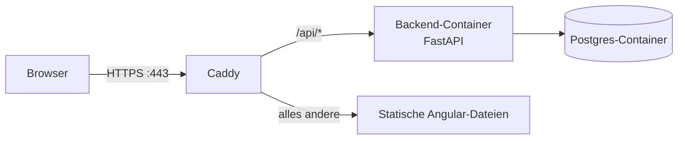

# SmartDesk – Deployment auf einem eigenen VPS

Diese Anleitung bringt SmartDesk auf einen gemieteten Linux-Server (VPS – Virtual Private Server), erreichbar über eine echte Domain mit automatischem HTTPS. Kein spezifischer Cloud-Anbieter vorausgesetzt – die Schritte funktionieren identisch auf Hetzner Cloud, DigitalOcean oder vergleichbaren Anbietern mit einem frischen Ubuntu-Server.

## Architektur



Ein einziger Server, drei Docker-Container (Caddy, Backend, Postgres) plus die fertig gebauten Angular-Dateien, die Caddy direkt ausliefert. Caddy ist gleichzeitig Reverse Proxy (leitet `/api/*` ans Backend weiter) und Webserver für die statische Angular-App – und holt sich automatisch ein gültiges HTTPS-Zertifikat von Let's Encrypt, sobald eine echte Domain konfiguriert ist.

**Warum ein Server für beides statt getrennter Dienste?** Damit Frontend und Backend aus Browser-Sicht dieselbe Origin sind (keine unterschiedliche Domain/Port) – das vermeidet CORS und macht den Auth-Cookie trivial "same-site", ganz ohne die Cross-Origin-Konfiguration, die für getrennte Origins nötig wäre.

## Voraussetzungen

- Account bei einem VPS-Anbieter (Konditionen/Preise beim jeweiligen Anbieter selbst prüfen, ändern sich häufig)
- Ein SSH-Schlüsselpaar auf dem eigenen Rechner (`ssh-keygen`, falls noch keins existiert)
- Eine Domain, die auf den Server zeigen kann. Zwei Optionen:
  - Eine echte Domain (günstige Registrare bieten TLDs oft für wenige Euro/Jahr)
  - Kostenlose Alternative ohne Domain-Kauf: [nip.io](https://nip.io) – `<server-ip>.nip.io` (z.B. `203.0.113.10.nip.io`) löst automatisch auf genau diese IP auf, ganz ohne eigene DNS-Konfiguration. Funktioniert für dieses Deployment genauso gut, inklusive echtem Let's-Encrypt-Zertifikat.

## Schritt 1: Server erstellen

Kleinste verfügbare Instanz reicht (SmartDesk ist ein leichtgewichtiger Stack) – 1–2 GB RAM, Ubuntu 22.04 oder 24.04 LTS. Beim Erstellen den eigenen SSH-Public-Key hinterlegen, damit der Login ohne Passwort per Schlüssel funktioniert.

## Schritt 2: Erstzugriff & Grundabsicherung

```bash
ssh root@<server-ip>

# System aktuell halten
apt update && apt upgrade -y

# Firewall: nur SSH, HTTP, HTTPS erlauben
ufw allow OpenSSH
ufw allow 80/tcp
ufw allow 443/tcp
ufw enable
```

Beim jeweiligen Cloud-Anbieter zusätzlich prüfen, ob es eine **eigene** Firewall auf Netzwerkebene gibt (getrennt von `ufw`, das nur innerhalb des Servers wirkt) – dort müssen dieselben drei Ports ebenfalls freigegeben sein, sonst bleibt der Server trotz `ufw` von außen unerreichbar.

## Schritt 3: Docker installieren

```bash
curl -fsSL https://get.docker.com | sh
```

Offizielles Docker-Installationsskript, funktioniert auf frischen Ubuntu-Servern zuverlässig und installiert direkt die aktuelle Docker-Engine inklusive Compose-Plugin.

## Schritt 4: Domain auf den Server zeigen lassen

Bei echter Domain: beim Domain-Registrar (oder DNS-Anbieter) einen **A-Record** anlegen, der auf die Server-IP zeigt. DNS-Änderungen brauchen Zeit, um sich zu verbreiten (Minuten bis Stunden) – vor dem nächsten Schritt mit `dig <domain>` oder `nslookup <domain>` prüfen, ob die IP schon korrekt zurückkommt.

Bei nip.io: nichts zu tun, `<server-ip>.nip.io` funktioniert sofort.

## Schritt 5: Projekt auf den Server holen

```bash
git clone https://github.com/okankpl/SmartDesk.git
cd SmartDesk
```

## Schritt 6: Produktions-`.env` anlegen

```bash
cp .env.example .env
nano .env   # oder ein anderer Editor
```

Werte, die sich gegenüber der lokalen Entwicklung ändern müssen:

```bash
# Echte, zufällige Werte statt der Beispielwerte - NIE die lokalen Dev-Werte wiederverwenden
POSTGRES_PASSWORD=<zufälliger Wert>
SECRET_KEY=<zufälliger Wert, z.B. per: python3 -c "import secrets; print(secrets.token_hex(32))">

# Muss zur echten Domain (bzw. nip.io-Adresse) passen
FRONTEND_ORIGIN=https://smartdesk.example.com
COOKIE_SECURE=true
```

Zusätzlich (für Caddy, siehe `docker-compose.prod.yml`):
```bash
DOMAIN=smartdesk.example.com
```

## Schritt 7: Frontend bauen

Wird als statische Dateien gebaut, nicht als eigener Container betrieben – Caddy liefert die fertigen Dateien direkt aus. Ein Node-Container übernimmt den Build-Schritt, ohne Node auf dem Server selbst installieren zu müssen:

```bash
docker run --rm -v "$(pwd)/frontend:/app" -w /app node:20 sh -c "npm ci && npx ng build --configuration production"
```

Ergebnis liegt danach in `frontend/dist/frontend/browser/` – genau der Pfad, den `docker-compose.prod.yml` in den Caddy-Container mountet.

## Schritt 8: Stack starten

```bash
docker compose -f docker-compose.prod.yml up -d --build
```

Danach die Datenbank-Migrationen ausführen (genau wie lokal, nur mit der Produktions-Compose-Datei):

```bash
docker compose -f docker-compose.prod.yml exec backend alembic upgrade head
```

Caddy braucht beim allerersten Start etwas Zeit, um das Let's-Encrypt-Zertifikat zu holen – Fortschritt in den Logs verfolgen:

```bash
docker compose -f docker-compose.prod.yml logs -f caddy
```

## Schritt 9: Testen

- `https://<domain>/api/health` → `{"status":"ok"}`
- `https://<domain>/api/docs` → Swagger UI
- `https://<domain>/` → Login-Seite

Test-Account über die Swagger UI anlegen (`POST /api/auth/register`), dann über die normale Oberfläche einloggen.

## Troubleshooting

| Symptom | Wahrscheinliche Ursache |
|---|---|
| Zertifikat wird nicht ausgestellt / Caddy-Logs zeigen Timeout | DNS zeigt noch nicht (richtig) auf die Server-IP, oder Port 80/443 ist irgendwo blockiert (Cloud-Firewall vs. `ufw` – beide prüfen) |
| `502 Bad Gateway` von Caddy | Backend-Container läuft nicht/ist noch am Starten - `docker compose -f docker-compose.prod.yml ps` und `logs backend` prüfen |
| Login funktioniert, aber Cookie kommt nicht an | `FRONTEND_ORIGIN`/`COOKIE_SECURE` in `.env` stimmen nicht mit der echten Domain überein, oder Seite wurde über `http://` statt `https://` aufgerufen |
| Seiten-Reload auf z.B. `/dashboard` gibt 404 | `try_files` im `Caddyfile` fehlt/falsch – sollte auf `index.html` zurückfallen (SPA-Routing) |

## Laufender Betrieb

Die Einzelschritte aus Schritt 7/8 oben (Frontend bauen, Container neu bauen, Migrationen anwenden) sind für spätere Updates als Skript zusammengefasst – nach dem allerersten Deployment reicht:

```bash
./scripts/deploy.sh
```

**Datenbank-Backup** (Postgres-Daten liegen im Docker-Volume `postgres_data` – bei einem Server-Verlust ohne Backup sind sie weg):
```bash
./scripts/backup.sh
```
Legt eine Datei unter `backups/` an und entfernt automatisch Backups, die älter als 7 Tage sind. Für automatische, regelmäßige Backups siehe den Cron-Hinweis am Ende des Skripts.

**Erreichbarkeit überwachen:**
```bash
./scripts/healthcheck.sh https://<domain>/api/health
```
Einfaches Beispiel für automatisiertes Monitoring – schreibt bei einem Ausfall ins System-Log. Für den Cron-Job siehe den Hinweis am Ende des Skripts. Für mehr als "läuft es noch" (Metriken, Dashboards, Benachrichtigungen) sind dedizierte Tools wie Uptime Kuma oder Prometheus/Grafana der nächste Schritt.
